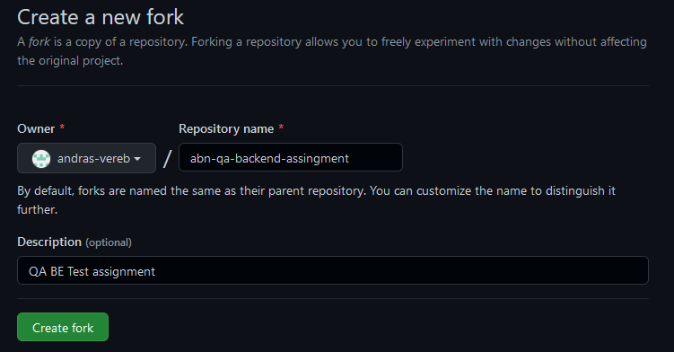
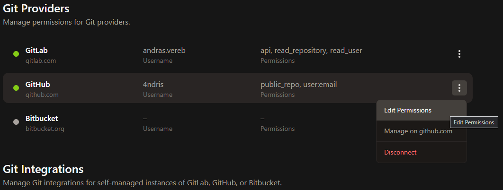

# Backend Test Automation Assignment 

## Requirements
### Environment
* GitHub account
* Java 11 (JDK) (optionally)
* Maven 3.6+ (optionally)
* Any IDE you comfortable with (eg. IntelliJ, VSCode)

### Skills
* Java 8+ (coding standards)
* Clean Code
* Maven
* Git, GitLab, GitHub

### Instructions
Fork this project

Example

   

#### Working in Web IDE (preferable)

1. Open Project in [GitPod](https://gitpod.io/from-referrer/):
2. Sing-in with GitHub account
3. Create and commit your solution into your forked repository
4. Create documentation in the README.md under the `Documentation` section
5. IMPORTANT: Enable Repository permissions (e.g. git push) for GitPod when coding from Web IDE here:
   https://gitpod.io/integrations
   

   
Details here

   Edit permission for GitHub:

   

   
   

## Documentation
_<< Your documentation comes here >>_

Below four test cases are designed with multiple validations -
1. Create an Issue
2. Edit an Issue
3. Get Issue details
4. Delete an Issue

Scripts are designed in the below classes.
1. \src\test\java\com\abnamro\assignment\SampleUnitTest.java
>> This class contains all 4 test cases.

2. \src\test\java\pojo\CreateIssue.java
>> Payload to create an Issue. Implemented pojo class concept with small json.

3. \src\test\java\resources\TestData.java
>> This class will build the test data as per the test case.
For now, this project will not read data from excel or external datasets, it can be implemented if required as a part of this assessment.
As of now, I am passing the required field values as variables.

4. \src\test\java\resources\Utils.java
>> All reusable methods e.g. request spec builder, reading property file, etc.

5. src\test\java\resources\global.properties
>>This file contains projectID, Token, and baseURL 

6.pom.xml
>> Dependencies added - rest-assured and jackson-databind.

